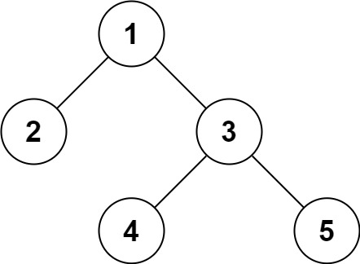

297. Serialize and Deserialize Binary Tree

Serialization is the process of converting a data structure or object into a sequence of bits so that it can be stored in a file or memory buffer, or transmitted across a network connection link to be reconstructed later in the same or another computer environment.

Design an algorithm to serialize and deserialize a binary tree. There is no restriction on how your serialization/deserialization algorithm should work. You just need to ensure that a binary tree can be serialized to a string and this string can be deserialized to the original tree structure.

Clarification: The input/output format is the same as how LeetCode serializes a binary tree. You do not necessarily need to follow this format, so please be creative and come up with different approaches yourself.

Example 1:

Input: root = [1,2,3,null,null,4,5]
Output: [1,2,3,null,null,4,5]

Example 2:

Input: root = []
Output: []

Constraints:

The number of nodes in the tree is in the range [0, 104].
-1000 <= Node.val <= 1000
